# High Level Architecture

Client
- Maintain only one websocket connection to the producer.
- Every message regradless room is sent through the connection to the producer
- Maintain multiple connections to the consumer. Each connection represention a room.

Producer
- Receive messages from the client and publish them to the message queue.
- Use circuit breaker for message publication. Data safety guaranteed.
- Queue connection pooling.

Consumer
- Manage client connections and forward messages from the message queue with retry.
- Acknowledgement after message being sent.
- Maintain an idempotency cache for one-time delivery guarantee.

# Sequence Diagram

# Client Design
High Throughput Connection Management 
- Connection manager maintains X send connections and 20*Y receive connections shared across threads

Reliable delivery
- Wait for ack from the producer and send with retry

Status Monitor
- Throughput monitor that reprot throughput every X seconds
- Progress monitor that report message sending progress every X seconds

# Consumer Design
Dynamic consumer scaling and allocation
- Start with an initial channel pool size.
- For every X seconds, check the load of each queue.
- If the number of messages in a queue execeeds 2000, add one more consumer to the queue.
- If the number of messages in a queue falls below 500, remove one consumer from the queue if there is more than one consumer.
- The dynmaic allocation algorithm makes sure the number of messages falls between 500 and 2000

Idempotency timeout cache for only-once delivery
- The cache keeps track of if a message has been sent to all the connected clients.
- A monitor thread will remove any entry in the cache if it has been created for more than TTL time.

Reliable delivery
- Messages are sent with retry and backoff.
- If a message failed to be deliveried to all the connected clients, it won't be acknowledged.

High throughput design
- Set consumer prefetch to be more than one.
- Each consumer's handleDelivery will be started as a thread.
- Each message delivery will be started as a thread.
- The handleDelivery will wait for every message delivery to finish and acknowledge.

Current Bottleneck
- Multiple threads are sharing only one receive connection
- Consider adding more connection

Some edge cases may happen
- Msg1 was sent earlier than Msg2 but it arrived later at the client than Msg2. 
- Msg1 and Msg2 were sent to all the client in room 7, but client2 only got Msg2.
- No active user in room1, but there are still messages in the queue.

# Producer Design
Queue Connection management
- Channel pooling for connection overhead reduction

Reliable Publishing
- Publish message with retry and send ack back to clients 

# System Tuning
I notice that the queue doesn't pile up because the consumer simply send messages to clients without processing. So I make each thread sleep for 100ms after sending messages to stimulate message processing.
## Single Server Best Throughput
Configuration
- 128 client threads and 32 send connections.
- 64 consumer threads for allocation, 128 messenger threads for allocation, and 10 prefetch count.

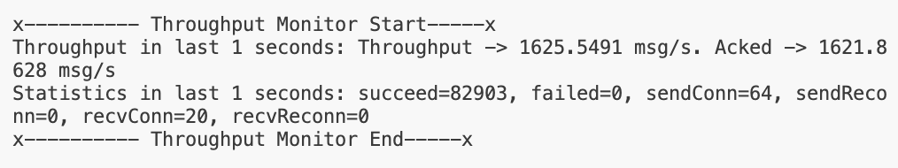
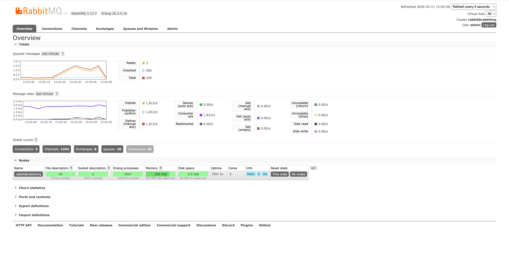
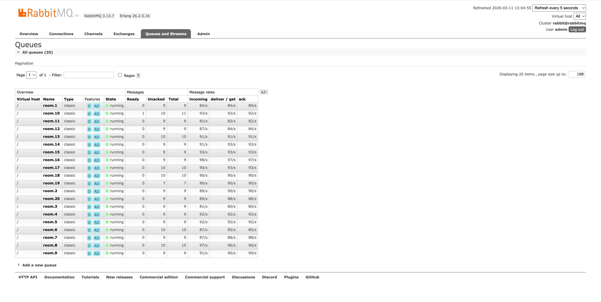

## Load Balanced
Two instance configuration
- 128 client threads and 64 send connections
- 64 consumer threads for allocation, 128 messenger threads for allocation, and 10 prefetch count.

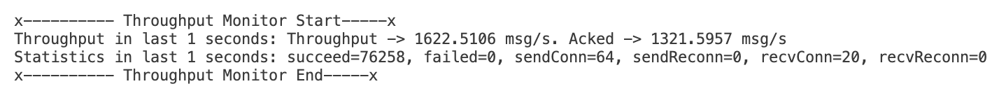
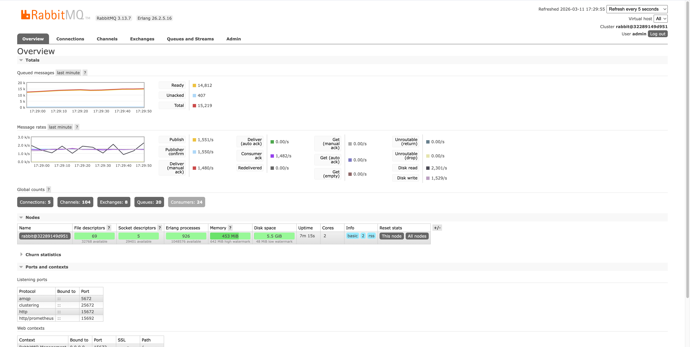

Four instance configuration
- 128 clients threads and 24 send connections
- 64 consumer threads for allocation, 128 messenger threads for allocation, and 10 prefetch count.

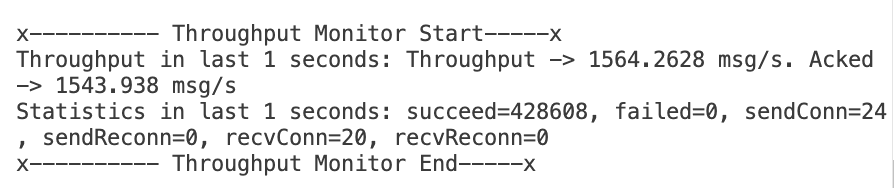
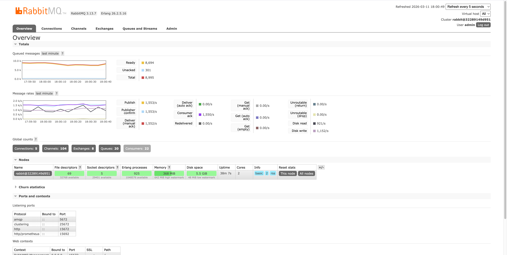

Load distribution
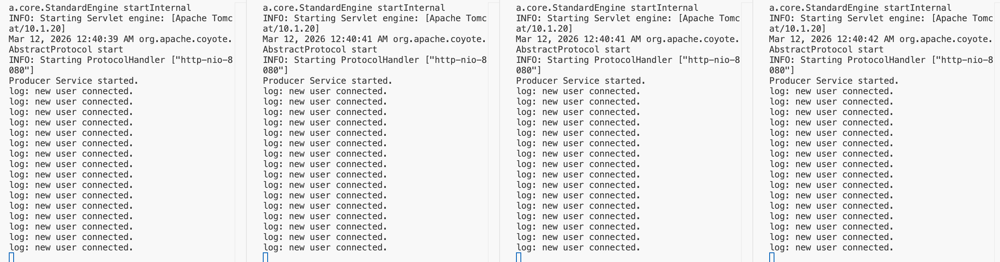

## Analysis
- Single server without load balancer achieved the best throughput
- Single server with load balancer achieved only 762 msg/s throughput
- Adding one more process can significantly improved throughput to around 2000 msg/s
- The bottleneck could be network round-trip and single process limitation

## Possible Optimization
- Multiple rooms can share one receive connection to reduce consumer overhead.
- Seperate client into send client and receive client.

## AWS and Queue Configuration
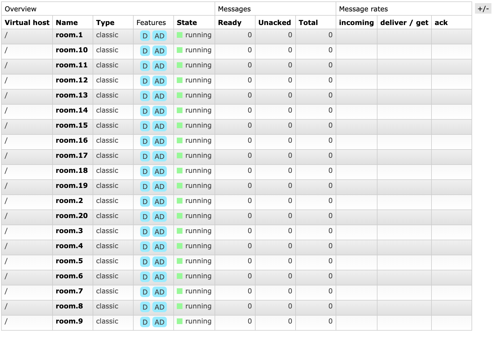
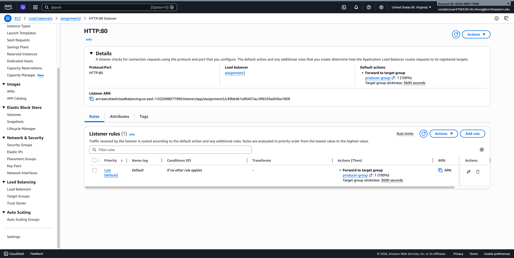
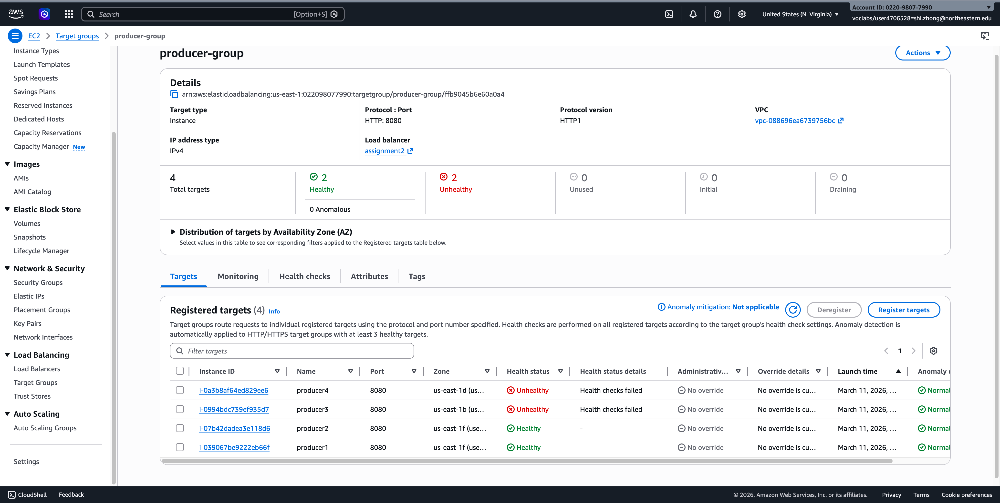